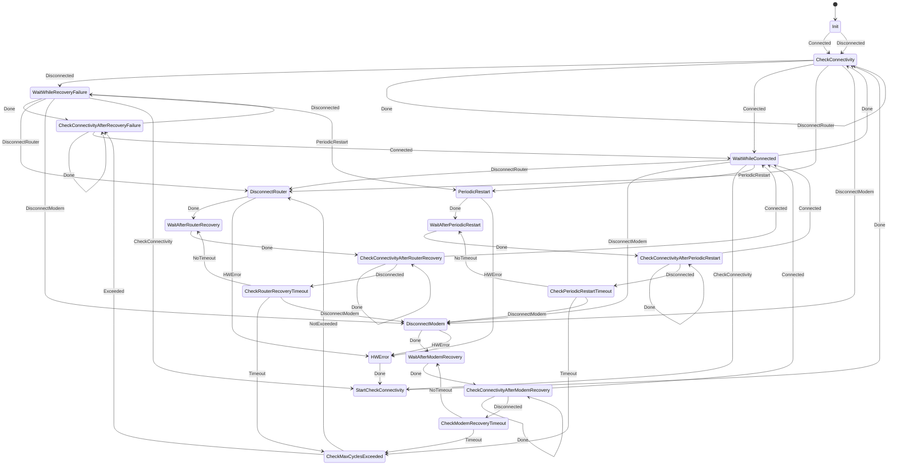

```mermaid
stateDiagram-v2
    [*] --> Init
    Init --> CheckConnectivity : Connected
    Init --> CheckConnectivity : Disconnected

    CheckConnectivity --> WaitWhileRecoveryFailure : Disconnected
    CheckConnectivity --> CheckConnectivity : Done
    CheckConnectivity --> WaitWhileConnected : Connected
    CheckConnectivity --> DisconnectRouter : DisconnectRouter
    CheckConnectivity --> DisconnectModem : DisconnectModem

    WaitWhileConnected --> CheckConnectivity : Done
    WaitWhileConnected --> DisconnectRouter : DisconnectRouter
    WaitWhileConnected --> DisconnectModem : DisconnectModem
    WaitWhileConnected --> StartCheckConnectivity : CheckConnectivity
    WaitWhileConnected --> PeriodicRestart : PeriodicRestart

    StartCheckConnectivity --> CheckConnectivity : Done

    DisconnectRouter --> WaitAfterRouterRecovery : Done
    DisconnectRouter --> HWError : HWError

    WaitAfterRouterRecovery --> CheckConnectivityAfterRouterRecovery : Done

    CheckConnectivityAfterRouterRecovery --> CheckConnectivityAfterRouterRecovery : Done
    CheckConnectivityAfterRouterRecovery --> WaitWhileConnected : Connected
    CheckConnectivityAfterRouterRecovery --> CheckRouterRecoveryTimeout : Disconnected

    CheckRouterRecoveryTimeout --> CheckMaxCyclesExceeded : Timeout
    CheckRouterRecoveryTimeout --> DisconnectModem : DisconnectModem
    CheckRouterRecoveryTimeout --> WaitAfterRouterRecovery : NoTimeout

    DisconnectModem --> WaitAfterModemRecovery : Done
    DisconnectModem --> HWError : HWError

    WaitAfterModemRecovery --> CheckConnectivityAfterModemRecovery : Done

    CheckConnectivityAfterModemRecovery --> CheckConnectivityAfterModemRecovery : Done
    CheckConnectivityAfterModemRecovery --> WaitWhileConnected : Connected
    CheckConnectivityAfterModemRecovery --> CheckModemRecoveryTimeout : Disconnected

    CheckModemRecoveryTimeout --> CheckMaxCyclesExceeded : Timeout
    CheckModemRecoveryTimeout --> WaitAfterModemRecovery : NoTimeout

    CheckMaxCyclesExceeded --> CheckConnectivityAfterRecoveryFailure : Exceeded
    CheckMaxCyclesExceeded --> DisconnectRouter : NotExceeded

    CheckConnectivityAfterRecoveryFailure --> CheckConnectivityAfterRecoveryFailure : Done
    CheckConnectivityAfterRecoveryFailure --> WaitWhileConnected : Connected
    CheckConnectivityAfterRecoveryFailure --> WaitWhileRecoveryFailure : Disconnected

    WaitWhileRecoveryFailure --> CheckConnectivityAfterRecoveryFailure : Done
    WaitWhileRecoveryFailure --> DisconnectRouter : DisconnectRouter
    WaitWhileRecoveryFailure --> DisconnectModem : DisconnectModem
    WaitWhileRecoveryFailure --> StartCheckConnectivity : CheckConnectivity
    WaitWhileRecoveryFailure --> PeriodicRestart : PeriodicRestart

    PeriodicRestart --> WaitAfterPeriodicRestart : Done
    PeriodicRestart --> HWError : HWError

    WaitAfterPeriodicRestart --> CheckConnectivityAfterPeriodicRestart : Done

    CheckConnectivityAfterPeriodicRestart --> CheckConnectivityAfterPeriodicRestart : Done
    CheckConnectivityAfterPeriodicRestart --> WaitWhileConnected : Connected
    CheckConnectivityAfterPeriodicRestart --> CheckPeriodicRestartTimeout : Disconnected

    CheckPeriodicRestartTimeout --> CheckMaxCyclesExceeded : Timeout
    CheckPeriodicRestartTimeout --> DisconnectModem : DisconnectModem
    CheckPeriodicRestartTimeout --> WaitAfterPeriodicRestart : NoTimeout

    HWError --> StartCheckConnectivity : Done
```