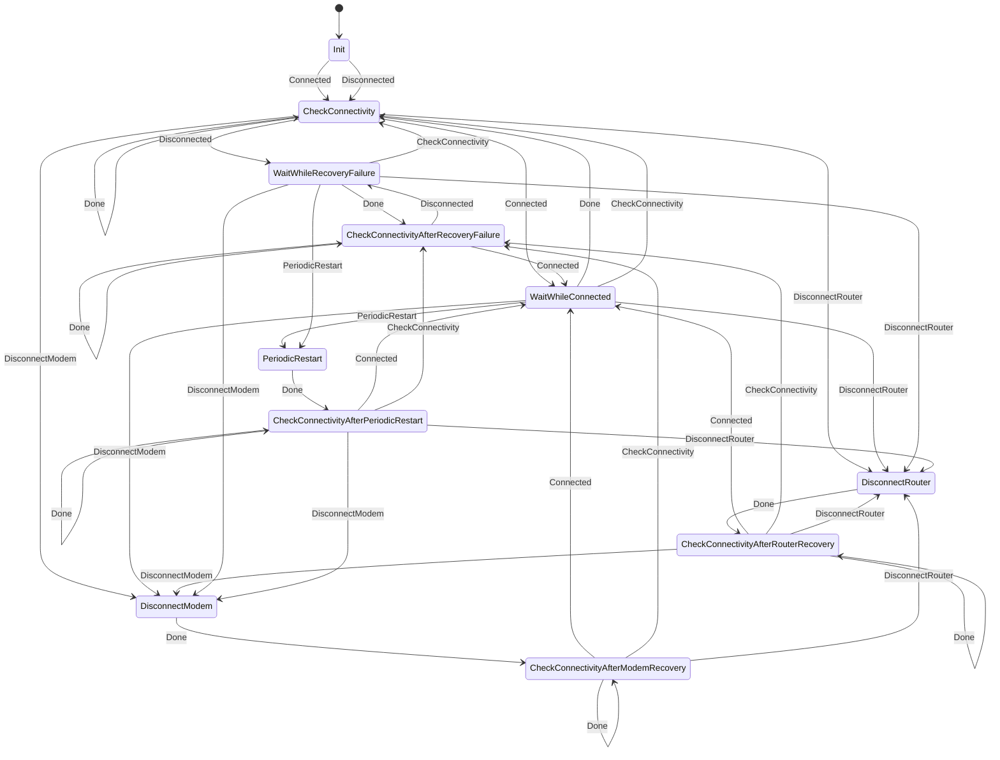

# Recovery State Machine Diagram

```mermaid
stateDiagram-v2
    [*] --> Init
    Init --> CheckConnectivity : Connected
    Init --> CheckConnectivity : Disconnected
    CheckConnectivity --> WaitWhileRecoveryFailure : Disconnected
    CheckConnectivity --> CheckConnectivity : Done
    CheckConnectivity --> WaitWhileConnected : Connected
    CheckConnectivity --> DisconnectRouter : DisconnectRouter
    CheckConnectivity --> DisconnectModem : DisconnectModem
    WaitWhileConnected --> CheckConnectivity : Done
    WaitWhileConnected --> DisconnectRouter : DisconnectRouter
    WaitWhileConnected --> DisconnectModem : DisconnectModem
    WaitWhileConnected --> CheckConnectivity : CheckConnectivity
    WaitWhileConnected --> PeriodicRestart : PeriodicRestart
    DisconnectRouter --> CheckConnectivityAfterRouterRecovery : Done
    CheckConnectivityAfterRouterRecovery --> CheckConnectivityAfterRouterRecovery : Done
    CheckConnectivityAfterRouterRecovery --> WaitWhileConnected : Connected
    CheckConnectivityAfterRouterRecovery --> CheckConnectivityAfterRecoveryFailure : CheckConnectivity
    CheckConnectivityAfterRouterRecovery --> DisconnectModem : DisconnectModem
    CheckConnectivityAfterRouterRecovery --> DisconnectRouter : DisconnectRouter
    DisconnectModem --> CheckConnectivityAfterModemRecovery : Done
    CheckConnectivityAfterModemRecovery --> CheckConnectivityAfterModemRecovery : Done
    CheckConnectivityAfterModemRecovery --> WaitWhileConnected : Connected
    CheckConnectivityAfterModemRecovery --> CheckConnectivityAfterRecoveryFailure : CheckConnectivity
    CheckConnectivityAfterModemRecovery --> DisconnectRouter : DisconnectRouter
    CheckConnectivityAfterRecoveryFailure --> CheckConnectivityAfterRecoveryFailure : Done
    CheckConnectivityAfterRecoveryFailure --> WaitWhileConnected : Connected
    CheckConnectivityAfterRecoveryFailure --> WaitWhileRecoveryFailure : Disconnected
    WaitWhileRecoveryFailure --> CheckConnectivityAfterRecoveryFailure : Done
    WaitWhileRecoveryFailure --> DisconnectRouter : DisconnectRouter
    WaitWhileRecoveryFailure --> DisconnectModem : DisconnectModem
    WaitWhileRecoveryFailure --> CheckConnectivity : CheckConnectivity
    WaitWhileRecoveryFailure --> PeriodicRestart : PeriodicRestart
    PeriodicRestart --> CheckConnectivityAfterPeriodicRestart : Done
    CheckConnectivityAfterPeriodicRestart --> CheckConnectivityAfterPeriodicRestart : Done
    CheckConnectivityAfterPeriodicRestart --> WaitWhileConnected : Connected
    CheckConnectivityAfterPeriodicRestart --> CheckConnectivityAfterRecoveryFailure : CheckConnectivity
    CheckConnectivityAfterPeriodicRestart --> DisconnectModem : DisconnectModem
    CheckConnectivityAfterPeriodicRestart --> DisconnectRouter : DisconnectRouter
```